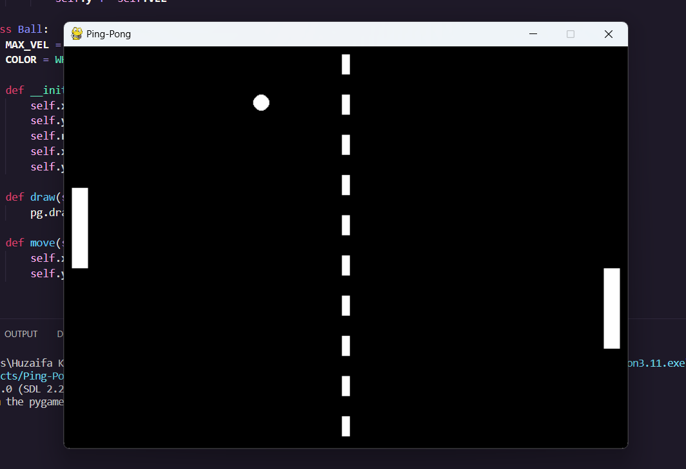

# Ping-Pong Game with Pygame

A simple implementation of the classic Ping-Pong game using the Pygame library.

## Description

This repository contains Python code for a Ping-Pong game implemented using the Pygame library. The game features two paddles controlled by players, bouncing a ball back and forth across the screen. The objective is to prevent the ball from passing your paddle while trying to make the ball pass the opponent's paddle.

## Features

- Two-player game.
- Player-controlled paddles.
- Ball bounce physics.
- Simple collision handling.

## Prerequisites

- Python 3.x
- Pygame library

## Installation

1. Clone the repository:

   [git clone https://github.com/botzaifa/ping-pong-game.git](https://github.com/botzaifa/Ping-Pong.git)

   - cd game

3. Install the required dependencies:

   pip install pygame

## Usage

1. Run the game script:

   python game.py

2. Player Controls:
   - Player 1 (Left Paddle):
     - Move Up: W
     - Move Down: S
   - Player 2 (Right Paddle):
     - Move Up: Up Arrow
     - Move Down: Down Arrow

3. Play the game by moving the paddles to hit the ball and prevent it from passing your side of the screen.

4. Press the "X" button in the game window to exit the game.

## Customization

You can customize various aspects of the game, such as paddle sizes, ball speed, and more, by modifying the constants defined at the beginning of the `game.py` script.

## Acknowledgments

This game was created as a simple project to practice Python programming and using the Pygame library.

## License

This project is licensed under the [GNU General Public License v3.0](LICENSE).

